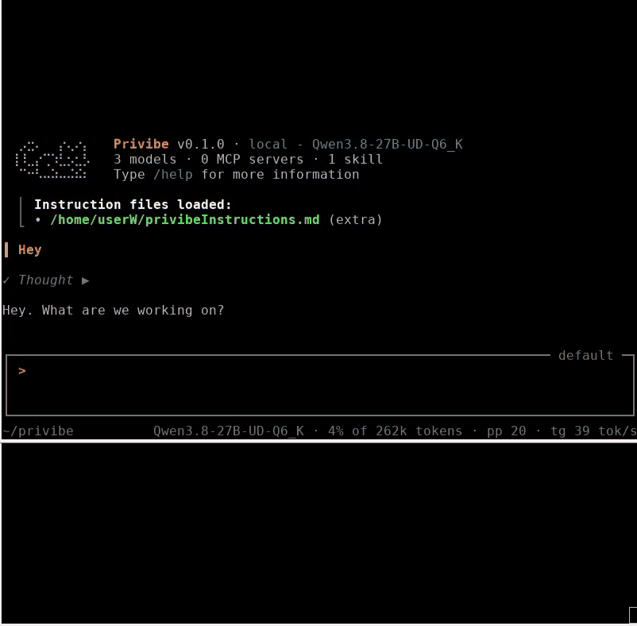
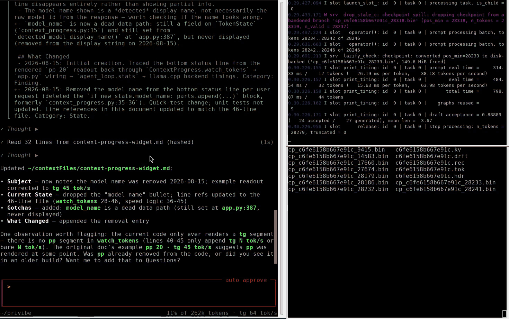

# privibe

CLI coding agent for private, local-first development.

privibe is a fork of [Mistral Vibe](https://github.com/mistralai/mistral-vibe)
reworked to not do any call back home of any kind and then run against **local** 
models first, I want to be able to use it and know it will not be sending data
of any kind anywhere.

The cloud/account machinery is gone, the Mistral SDK is now an optional extra, 
and a lot of work has gone into making it fast and pleasant to use against a local
[llama.cpp](https://github.com/ggml-org/llama.cpp) server.

If you want the original, hosted, Mistral-centric experience, use upstream
Mistral Vibe. If you want a small coding agent you can point at your own local
llama.cpp server, this is that.


Step-by-step version of this demo: [docs/getting-started.md](docs/getting-started.md).

Resuming and switching between sessions, plus context files in action: the
lets-document skill compiles what one session learned into a context file, and
a second, unrelated session picks up from that knowledge without redoing the
research (played at 4x):



Resuming a session with its KV cache restored from disk: with the companion
[llama-server build](https://github.com/alainnothere/llama.cpp/tree/disk-cache-eviction),
evicted conversations are saved to disk and reloaded on resume, so picking an
old session back up does not reprocess the whole conversation:



> **Note on backends:** this fork is developed and tested against a local
> **llama.cpp** server (via its OpenAI-compatible API). The Anthropic and
> Mistral backend adapters inherited from upstream are still in the code but are
> **not actively tested here** — treat them as unverified.

## Install

Requires Python ≥ 3.12 and [uv](https://docs.astral.sh/uv/).

```bash
git clone https://github.com/alainnothere/privibe.git
cd privibe
uv sync
```

## Run

I set up an alias on .bashrc

```bash
alias privibe='uv run --project /yourPathToPrivibeHere/privibe privibe'
```

so you can later just use it with privibe from whenever you are, or inside privibe folder with

```bash
uv run privibe
```

On first run it writes a config to `~/.privibe/config.toml`. Point the model
entries at your server (e.g. a local llama.cpp instance) and you're going.

There's also an ACP entrypoint for editor integrations:

```bash
uv run privibe-acp
```

## Run on windows

For the most part... exactly the same, clone the source and uv run privibe... I use it daily on git bash and works correctly, I have also tried powershell and I know it works.

## How it differs from Mistral Vibe

### Local-first
- Built around a local llama.cpp server (OpenAI-compatible API). The Mistral SDK
  is an **optional** extra (`uv sync --extra mistral`), not a requirement, and
  there's no API-key onboarding gate.
- The upstream Anthropic and Mistral backend adapters are still present but are
  not tested in this fork (see the note at the top).
- Removed the cloud and account features (nuage/teleport), telemetry, tracing,
  the update notifier, plan offers, data-retention, and remote auth — along with
  their dead code and tests. De-branded from Mistral Vibe throughout.
  If you find anything calling home is not intentional, I miss it, please create
  an issue and we'll nuke that code into outer space....

### Tuned for local llama.cpp / KV cache
- Conversation state is held in a structure (`ConversationList`) that keeps the
  prefix immutable, so the server's prompt/KV cache stays valid across turns.
- KV cache is preserved on `--resume`/`--continue` by restoring the original
  system prompt instead of regenerating it (which would invalidate the cache).
- Context-size auto-detection with a `/detect-context-size` toggle (re-runs on
  model swap), and an opt-in model warmup.
- Per-message reasoning effort: `/effort` cycles off/low/medium/xhigh for new
  messages without invalidating the KV cache. Needs the companion
  [llama-server build](https://github.com/alainnothere/llama.cpp/tree/disk-cache-eviction);
  stock servers silently ignore the stamps.
- Long sessions stay responsive: the transcript is windowed behind a
  "Load more" button, and streaming output is render-throttled so drawing
  keeps up even when the model generates faster than the terminal can paint.
- Tolerates SSE keep-alive pings from newer llama.cpp servers.

### Expanded code-editing toolset
- Hashed-line file tools split into explicit single-line, block, and delete
  operations, plus `find_symbol`.
- Per-agent file **undo stack** with a `restore_file` tool; writes are
  serialized.
- Tuned for smaller local models: best-effort indent correction on edits,
  hashed line addresses re-pointed when earlier edits shift them, and naive
  reads of huge files return a head preview plus guidance instead of flooding
  the context.
- Cross-dialect path translation (Windows / WSL / Git Bash / Cygwin) with a
  `[paths]` config section.
- `@`-mention file completion backed by a stateless git enumeration.

### TUI / UX
- **Console mode**: `--console` runs the same agent as a plain-text REPL (no
  colors, no TUI), including tool output and session resume.
- **Rewind**: Alt+Up browses your previous messages; fork the conversation
  from any of them, and optionally restore files to that point (the file
  restore is gated behind a typed confirmation code).
- **Agent steering**: queue messages mid-turn instead of cancelling the agent.
- Double-press `Ctrl+C` to exit (no more accidental one-key quits).
- Clipboard fixes for Linux/X11 terminals, a `/autocopy` toggle, and a warning
  when clipboard tools are missing.
- `/resume` session picker showing the folder and a short preview of each
  session, with search: type to filter, `-word` to exclude, results ranked by
  match. Conversation history is re-rendered on resume.
- File edits show a diff in the TUI.
- Model name + tokens/sec in the context footer.
- Configurable tool-result preview length (`/preview-lines`), scrollback
  (`/scrollback`), a per-message LLM-call budget that makes a looping model
  write up and stop (`/llm-calls-per-turn`), and an `/llm-debug` dump toggle.
- Subagent work is preserved when you cancel mid-execution.

### Skills, config, packaging
- Bundled sample skill (lets-document) with auto-discovery and load-error
  surfacing.
- Model selection skips entries with a missing API-key env var and falls back to
  a valid model; config upgrades append commented stubs for new keys.
- Datetime-based version stamping; `.deb` and Windows-zip build scripts.

## Configuration

Config lives in `~/.privibe/config.toml` (set `PRIVIBE_HOME` to relocate it).
The `[paths]` section (documented in
`privibe/core/config/default_config.toml`) controls cross-dialect path
translation. Models, providers, and feature toggles are set there too; several
have in-app `/commands` (`/model`, `/config`, `/autocopy`, … — see `/help`).
The active model can also be picked for a single run with `--model`.

## License

Apache-2.0. privibe is a fork of Mistral Vibe (© Mistral AI); see `LICENSE`.
